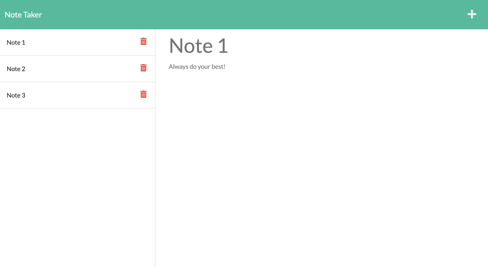

# Note-Taker-Challenge-11

## Description
This is the eleventh challenge in the Northwestern Coding Bootcamp (Module 11). In this simple note-taker application, we were given all of the front end code and were expected to correctly route all user requests and server responses using the Express npm through node.js. We used the GET, POST, and DELETE methods to allow users to input notes and have them saved on the backend, displayed on the front end, as well as deleted from the database. Personally, I used Insomnia to test the backend functionality before testing the functionality from the front end.

We were also expected to successfully deploy our application using Heroku (see live link below).

## Link to live page
[Live Link](https://radiant-savannah-46901.herokuapp.com/)

## Screenshot


## User Story
```
AS A small business owner
I WANT to be able to write and save notes
SO THAT I can organize my thoughts and keep track of tasks I need to complete
```


## Acceptance Criteria
```
GIVEN a note-taking application
WHEN I open the Note Taker
THEN I am presented with a landing page with a link to a notes page
WHEN I click on the link to the notes page
THEN I am presented with a page with existing notes listed in the left-hand column, plus empty fields to enter a new note title and the note’s text in the right-hand column
WHEN I enter a new note title and the note’s text
THEN a Save icon appears in the navigation at the top of the page
WHEN I click on the Save icon
THEN the new note I have entered is saved and appears in the left-hand column with the other existing notes
WHEN I click on an existing note in the list in the left-hand column
THEN that note appears in the right-hand column
WHEN I click on the Write icon in the navigation at the top of the page
THEN I am presented with empty fields to enter a new note title and the note’s text in the right-hand column
```